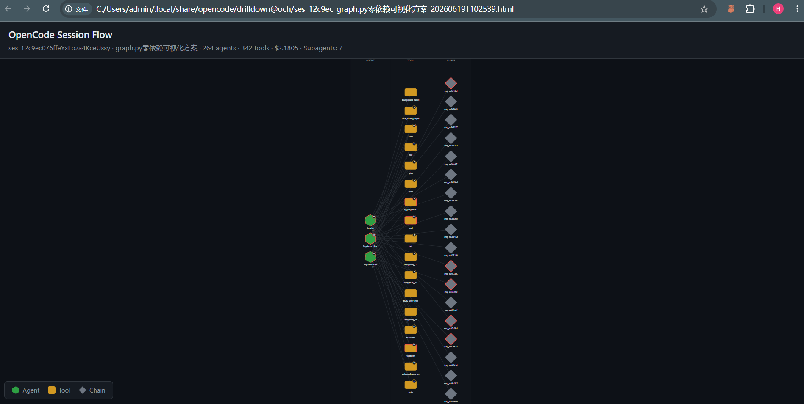
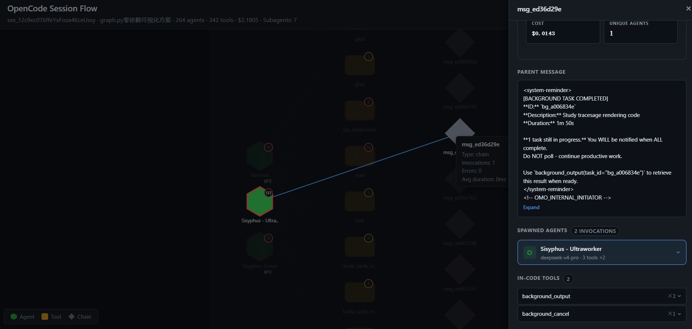
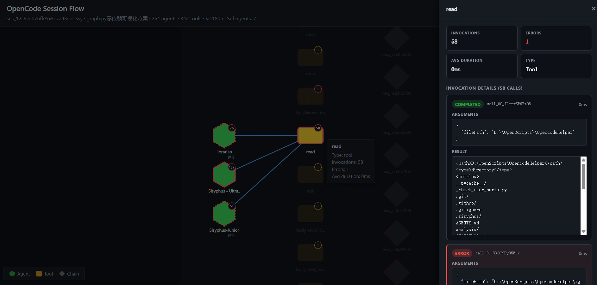

<div align="center">

# Opencode-Helper

**摸清 OpenCode 都在干什么。优化你的配置。**

[](https://www.python.org/downloads/)
[](LICENSE)
[]()

一个统一的 Python 命令行工具，扩展 [OpenCode](https://github.com/sst/opencode) 的官方能力之外 —— 清理 session 残留、审计临时文件,并分析你的使用模式(模型、工具、MCP、Skills),找到优化空间。

[English](README.md) · [简体中文](README_zh.md)

</div>

> **声明**：Opencode-Helper 是一个独立的社区维护工具，**并非**由 [OpenCode](https://github.com/sst/opencode) 团队构建、关联或背书。本项目通过读取 OpenCode 的本地数据文件来提供辅助功能，不拥有任何特殊权限。

---

## 目录

- [为什么需要 Opencode-Helper?](#为什么需要-opencode-helper)
- [功能特性](#功能特性)
- [安装](#安装)
- [快速上手](#快速上手)
- [命令参考](#命令参考)
  - [cleanup(清理)](#cleanup清理)
  - [analysis(分析)](#analysis分析)
  - [drilldown(深挖)](#drilldown深挖)
- [配置说明](#配置说明)
- [安全模型](#安全模型)
- [已知局限](#已知局限)
- [运行环境要求](#运行环境要求)
- [项目结构](#项目结构)
- [开源协议](#开源协议)

---

## 为什么需要 Opencode-Helper?

OpenCode 是个非常优秀的 AI 编程 Agent,但日常使用中有几个"没人管"的角落:

1. **Session 膨胀** — Session 在 `~/.local/share/opencode/opencode.db` 里只增不减。用几周后,SQLite 文件可能膨胀到 GB 级,而且**官方没有清理入口**。
2. **临时文件堆积** — OpenCode 启动时会创建 `%TEMP%\opencode\`,但**从不清理**。AI 生成的脚本、克隆的 repo、数据文件永久堆积。
3. **缺乏可观测性** — 你没法直接看到:实际最常调用哪个模型?哪些工具失败最多?加载了哪些 Skills?Windows 上跑 bash 有没有问题?

**Opencode-Helper 一次解决三件事**,还附带 AI 驱动的使用模式分析,帮你持续优化配置。

## 功能特性

### 🧹 清理(Cleanup)

| 命令 | 作用 |
|---|---|
| `session` | 删除 SQLite 里的旧 session,VACUUM 释放磁盘,可选自动备份。支持 Save List 永久保留关键 session。 |
| `tempfile` | 清理 `%TEMP%\opencode\` 下 AI 生成的脚本和克隆的 repo。脚本/数据文件 vs. 项目目录分别配置保留期。 |

### 📊 分析(Analysis)

每个分析命令都读取 OpenCode 实时数据库生成报告。多数命令还会调起 `opencode run` 生成 AI 解读。默认使用自动选定的**免费模型**；你也可以在 `settings.jsonc` 中通过 `analysis_model` 指定优先使用的模型。如果配置的模型失败，会自动回退到免费模型。

| 命令 | 作用 |
|---|---|
| `harness` | **建议从这里开始。** Session 全景回顾:效率、生命周期、agent 切换、归档状态。AI 优化建议。 |
| `tools` | 工具使用效率:Read:Edit 比例(目标 >6.0)、错误率、重试链检测(3+ 连续同工具失败)。 |
| `mcp` | MCP 工具调用模式:按 server 拆分、错误聚类、AI 根因诊断。 |
| `models` | 模型使用分布:调用次数、花费、Token。模型切换事件。Agent-Model 交叉分析。 |
| `skills` | Skill 调用次数和错误率。平台兼容性检查(标记 Windows 上误用 bash 的情况)。 |

### 🔍 深挖(Drilldown)

单 session 深挖，可视化 agent 调用拓扑 — 看清你的 agent 之间到底是怎么调度的。

| 命令 | 作用 |
|---|---|
| `drilldown` | **单 session 深挖。** 将 agent 调用拓扑可视化为可交互的 SVG 时间线图。展示 agent 派生、工具调用序列、并行执行组(SpawnGroup)、子 agent 递归和错误模式。两种输出模式:HTML(可拖拽缩放、暗色主题、点击聚焦)和终端树图(ANSI)。 |



> *交互式 session 拓扑图，展示 agent 调用、工具调用和并行派生组。*

### ✨ 设计要点

- **零外部依赖** — 纯 Python 标准库(sqlite3, json, pathlib, subprocess, …)。不需要 `pip install`,不需要虚拟环境。
- **默认 dry-run** — 所有破坏性命令都先预览。加 `--execute` 才真正执行。
- **AI 输出支持多语言** — 遵循 `analysis_language` 设置(`en`, `zh-CN`, `ja`, `fr` 等)。
- **OpenCode 运行中也安全** — 分析纯只读,任何时候都能跑。Cleanup 在 `--execute` 模式下检测到 `opencode.exe` 在跑会**直接拒绝执行**。
- **遵循 XDG 规范** — 数据库和存储路径通过 `XDG_DATA_HOME` 自动识别。需要时手动覆盖。

## 安装

```bash
# 克隆仓库
git clone https://github.com/v587d/opencode-helper.git
cd opencode-helper

# 方式 A：全局安装（推荐）
pip install -e .
och --help              # 任意目录直接使用

# 方式 B：直接运行（无需安装）
python main.py --help   # 需在项目根目录
```

通过 `och`（推荐）或 `python main.py` 调用 CLI。`analysis/*` 子命令还需要 [`opencode`](https://github.com/sst/opencode) 二进制在 `PATH` 中（因为会派生 `opencode run` 来获取 AI 解读）。

## 快速上手

```bash
# 1. 查看所有命令
och --help

# 2. 看看 OpenCode 一直在干什么
och harness

# 3. 检查工具使用效率
och tools

# 4. 找出可清理的 session（dry-run，OpenCode 运行中也安全）
och session

# 5. 真正清理（必须先关闭 OpenCode）
och session --execute

# 6. 清掉过期的临时文件
och tempfile --execute

# 7. 可视化最新 session 的 agent 调用拓扑
och drilldown
```

通过 `python main.py` 在项目根目录调用 CLI。`analysis/*` 子命令还需要 [`opencode`](https://github.com/sst/opencode) 二进制在 `PATH` 中(因为会派生 `opencode run` 来获取 AI 解读)。

## 快速上手

```bash
# 1. 查看所有命令
python main.py --help

# 2. 看看 OpenCode 一直在干什么
python main.py harness

# 3. 检查工具使用效率
python main.py tools

# 4. 找出可清理的 session(dry-run,OpenCode 运行中也安全)
python main.py session

# 5. 真正清理(必须先关闭 OpenCode)
python main.py session --execute

# 6. 清掉过期的临时文件
python main.py tempfile --execute
```

## 命令参考

### `cleanup`(清理)

#### `session` — 清理旧 session

```bash
# Dry-run: 列出将被删除的内容
och session

# Execute: 删除 + VACUUM
och session --execute

# 保留 14 天而不是 7 天
och session --execute --days 14

# 跳过备份（不推荐）
och session --execute --no-backup

# 永久保留特定 session
och session --add ses_abc123
och session --add ses_abc123 --label "我的重构 session"
och session --list
och session --remove ses_abc123
```

- **默认保留期**: `settings.jsonc` 中的 `session_retention_days`(7 天)。
- **自动备份**: 删除前生成带时间戳的副本,可直接还原。
- **VACUUM**: 自动执行,回收空闲页。
- **CASCADE**: 删除 session 会级联清理其 message、part、todo、session_share。
- **Save List**: 在 `settings.jsonc::session_save_list` 中列出的 session 永远不会被删除。

#### `tempfile` — 清理 `%TEMP%\opencode\`

```bash
# Dry-run
och tempfile

# Execute
och tempfile --execute

# 激进策略：脚本 3 天、项目 5 天
och tempfile --execute --scripts 3 --projects 5

# 安静模式（不打印每个文件）
och tempfile --execute --quiet
```

- **范围严格收敛** — 只动 `%TEMP%\opencode\`。不会动数据目录、系统 Temp 根目录、其它任何位置。
- **两类保留期**: 零散文件(脚本、数据)vs. 项目目录(克隆的 repo、scaffold)。
- **项目识别** 通过签名文件(`.git`、`package.json`、`pyproject.toml` …)。

### `analysis`(分析)

#### `harness` — Session 全景回顾 *(建议从这里开始)*

```bash
# 最近 7 天（默认），带 AI 解读
och harness

# 最近 30 天
och harness --days 30

# 只要数据，跳过 AI
och harness --no-ai
```

输出: Session 概览、生命周期(时长/消息数)、Agent 切换事件、归档 vs. 活跃数量、效率快照、**AI 优化建议**。

#### `tools` — 工具使用效率

```bash
# 所有 session
och tools

# 单个 session
och tools --session ses_abc123

# 只要数据
och tools --no-ai
```

输出: 工具调用分布与错误率、**Read:Edit 比例**(目标 >6.0)、工具错误明细、重试链检测(3+ 连续同工具失败)。

#### `mcp` — MCP 工具分析

```bash
# 所有 MCP server
och mcp

# 只看某个 server
och mcp --server tavily
och mcp --server websearch
och mcp --server context7

# 只要数据
och mcp --no-ai
```

输出: 每个工具的概览、按 server 汇总、按工具分组的错误明细、**AI 根因诊断**。

#### `models` — 模型使用模式

```bash
# Top 10 模型
och models

# Top 20
och models --limit 20

# 只要数据
och models --no-ai
```

输出: 模型使用分布(调用、花费、Token)、模型切换事件、Agent-Model 交叉分析、**AI 解读**。

#### `skills` — Skill 使用与平台兼容性

```bash
# 所有 skill
och skills

# Top 10
och skills --limit 10

# 只要数据
och skills --no-ai
```

输出: Skill 调用次数和错误率、Shell 工具使用(标记 Windows 上误用 bash)、用户消息中引用的 Skill、**AI 兼容性诊断**。

### `drilldown`(深挖)

#### `drilldown` — 单 session 拓扑可视化

```bash
# 可视化最新 session(打开交互式 HTML 浏览器)
och drilldown

# 指定 session
och drilldown --session ses_abc123

# 终端树图(无需浏览器)
och drilldown --text

# 列出可深挖的 session
och drilldown --list

# 自定义输出路径，不自动打开浏览器
och drilldown -o my_report.html --no-open

# 禁用子 agent 递归(仅根 session)
och drilldown --no-recurse
```



> *Agent 调用链，展示父子关系和派生组。*

- **两种渲染器**: HTML(默认) — 自包含 SVG/CSS/JS，暗色主题，可拖拽缩放、点击聚焦、悬停提示。`--text` — ANSI 终端树图，带 `[dN]` 深度标记。
- **子 agent 递归**: 默认通过 `session.parent_id` CTE 递归所有子 agent session。使用 `--no-recurse` 仅展示根 session。
- **并行检测**: SpawnGroup 识别同一父消息派生的并发 agent。仅 ≥2 的组。
- **输出存储**: 自动保存至 `~/.local/share/opencode/drilldown@och/`，确定性命名。可用 `-o` 覆盖。
- **只读操作**: 纯 SELECT — OpenCode 运行时也可安全执行。



> *工具调用详情，展示输入参数、输出、耗时和状态。*

## 配置说明

所有开关都在 [`settings.jsonc`](settings.jsonc)(JSON + 注释格式)。默认值是合理的 — 你通常只需要在以下两种情况下编辑:
1. 扩展 **session save list** 永久保留关键 session
2. 切换 **analysis_language** 让 AI 用你的语言输出

```jsonc
{
    // Session 保留天数
    "session_retention_days": 7,

    // 备份与 VACUUM 行为
    "session_auto_backup": true,
    "session_auto_vacuum": true,

    // 临时文件保留(零散文件 vs. 项目目录)
    "temp_script_retention_days": 1,
    "temp_project_retention_days": 1,

    // 这里列出的 session 永远不会被删除
    "session_save_list": {
        // "ses_abc123": "我的重构 session"
    },

    // 覆盖 DB 路径(默认: XDG_DATA_HOME/opencode/opencode.db)
    "db_path_override": null,

    // AI 分析输出语言
    // 支持: "en", "zh-CN", "zh-TW", "ja", "ko", "fr", "de", "es", "pt", "ru"
    // 或者任意自然语言指令,例如 "in French"
    "analysis_language": "en",

    // AI 分析使用的模型。留 null 则自动选择免费模型。
    // 示例: "opencode/mimo-v2.5-free"
    "analysis_model": null,

    // 模型变体（推理强度）。部分模型支持: "low", "medium", "high"。
    // "low" 可降低工具调用倾向。留 null 则不传 variant。
    "analysis_variant": null
}
```

未知键会被静默忽略,所以你可以在文件里加注释和废弃条目而不破坏任何东西。

## 安全模型

Opencode-Helper 的设计原则:**很难用错**。

| 层次 | 保护 |
|---|---|
| **默认 Dry-run** | 所有破坏性命令(`session`、`tempfile`)都先预览。必须显式加 `--execute` 才会真正改状态。 |
| **进程检查** | `session --execute` 和 `tempfile --execute` 在 `opencode.exe` 仍在运行时**直接拒绝执行**。使用 `tasklist`,PowerShell 兜底。 |
| **自动备份** | `session` 在删除前生成带时间戳的 `*.backup_YYYYMMDD_HHMMSS.db` 文件。可用 `--no-backup` 跳过(不推荐)。 |
| **Save List** | 把 Session ID 加到 `session_save_list` 就等于声明它永生。 |
| **范围严格** | `tempfile` 只动 `%TEMP%\opencode\`。永远不动数据目录、系统 Temp 根、其它任何东西。 |
| **只读分析** | 所有 `analysis/*` 命令对数据库纯只读。OpenCode 运行中也能跑。 |
| **WAL 安全的 VACUUM** | 清理流程在 VACUUM 前后都做 checkpoint,保持 WAL 模式一致。 |

## 已知局限

Opencode-Helper 通过直接检查 OpenCode 的内部结构来工作,这带来了几个固有限制:

| 局限 | 影响 | 缓解措施 |
|---|---|---|
| **私有 SQLite Schema** | `opencode.db` 的 schema 是 OpenCode 的内部契约 — 不是公开 API。OpenCode 未来升级时若重命名表、增减字段或改变数据格式,**可能在不经警告的情况下导致本工具出错**。 | 大部分分析查询是针对稳定表(`session`、`message`、`part`)的简单 SELECT。Cleanup 使用 CASCADE 删除,对 schema 增列具有鲁棒性。如遇问题请通过 GitHub Issues 反馈。 |
| **依赖 `opencode` CLI** | `analysis/*` 子命令会派生 `opencode run` 来生成 AI 解读。如果没装 OpenCode 或不在 `PATH` 中,这些子命令会失败。 | 使用 `--no-ai` 获取纯数据输出(无需 CLI)。Cleanup 子命令(`session`、`tempfile`)**从不**需要 OpenCode。 |
| **进程检测仅支持 Windows** | 安全检查(`opencode.exe` 是否在运行?)使用 `tasklist` 和 PowerShell,这是 Windows 专有的。在 macOS/Linux 上,这个检查直接不会触发 — 你必须手动关闭 OpenCode 再运行 `--execute`。 | 欢迎提交基于 `pgrep` / `ps` 的 Unix 检测 PR。 |

## 运行环境要求

- **Python 3.10+**(用到 `dict[str, str]`、`list[...]`、`|` union 语法)
- **不需要任何 Python 包** — 纯标准库
- **`opencode` 二进制**在 `PATH` 中(只在 `analysis/*` 调 AI 解读时需要)
- **SQLite 数据库**位于 `~/.local/share/opencode/opencode.db`(可在 `settings.jsonc` 覆盖)

测试环境:
- Windows 11 + Python 3.12
- 代码里用了 `tasklist` 和 PowerShell 跑进程检查,非 Windows 平台需要替换这个助手。

## 项目结构

```
Opencode-Helper/
├── main.py                 # 统一 CLI 派发器
├── utilities.py            # 共享:配置、日志、DB、路径、进程检查
├── settings.jsonc          # 用户可编辑的配置
│
├── cleanup/                # 磁盘空间回收
│   ├── session.py          # 删除旧 session + VACUUM
│   └── tempfile.py         # 清理 %TEMP%\opencode\
│
├── analysis/               # 使用分析
│   ├── common.py           # 共享:SQL 查询、免费模型发现、AI 调用
│   ├── harness.py          # Session 全景
│   ├── tools.py            # 工具效率
│   ├── mcp.py              # MCP 分析
│   ├── models.py           # 模型使用
│   ├── skills.py           # Skill + 平台兼容性
│   └── prompts/            # AI prompt 模板(每个分析一份)
│       ├── harness.md
│       ├── tool_efficiency.md
│       ├── mcp_analysis.md
│       ├── models.md
│       └── skills.md
│
├── drilldown/              # 单 session 拓扑可视化
│   ├── cli.py              # 子命令注册 + CLI 入口
│   ├── graph.py            # SessionGraph 构建 (AgentStep → ToolCall, SpawnGroup)
│   ├── render.py           # HTML (内嵌 SVG/CSS/JS) + ANSI 终端渲染器
│   └── storage.py          # 输出文件命名与存储管理
│
├── assets/                 # 文档截图
│   ├── session_opology_diagram.png
│   ├── agent.png
│   ├── chain.png
│   └── tool.png
│
├── README.md               # 英文文档
├── README_zh.md            # 本文件
├── LICENSE                 # MIT
└── .gitignore
```

每个类别模块对外暴露 `register_subparser(subparsers)` 函数。新增一个类别只需在 `main.py` 加一个 import 和一行调用。参考 `cleanup/` 或 `analysis/` 的实现。

## 开源协议

[MIT](LICENSE) — 自由使用,无任何担保。
